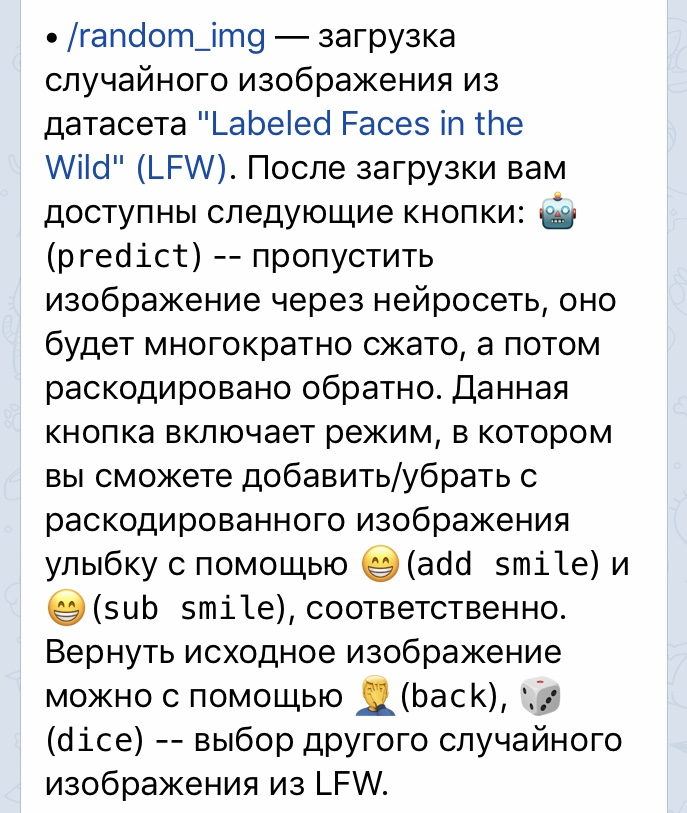

# [@deep-autoencoder-bot](https://t.me/deep_autoencoder_bot)

Учебный проект для курса Deep Learning (2018-2019) от [Deep Learning School](https://github.com/DLSchool/dlschool/). В нем реализована и обучена модель глубокого автокодировщика [deep autoencoder](https://towardsdatascience.com/applied-deep-learning-part-3-autoencoders-1c083af4d798) для лиц людей. Для обучения использовался датасет ["Labeled Faces in the Wild" (LFW)](http://vis-www.cs.umass.edu/lfw/). С помощью бота вы можете добавить/убрать улыбки людям из датасета LFW или на своём фото, а также посмотреть, во что нейросеть раскодирует случайные нормально распределенные вектора. Подробности в /help.

## Команды
### /random_img
> 
